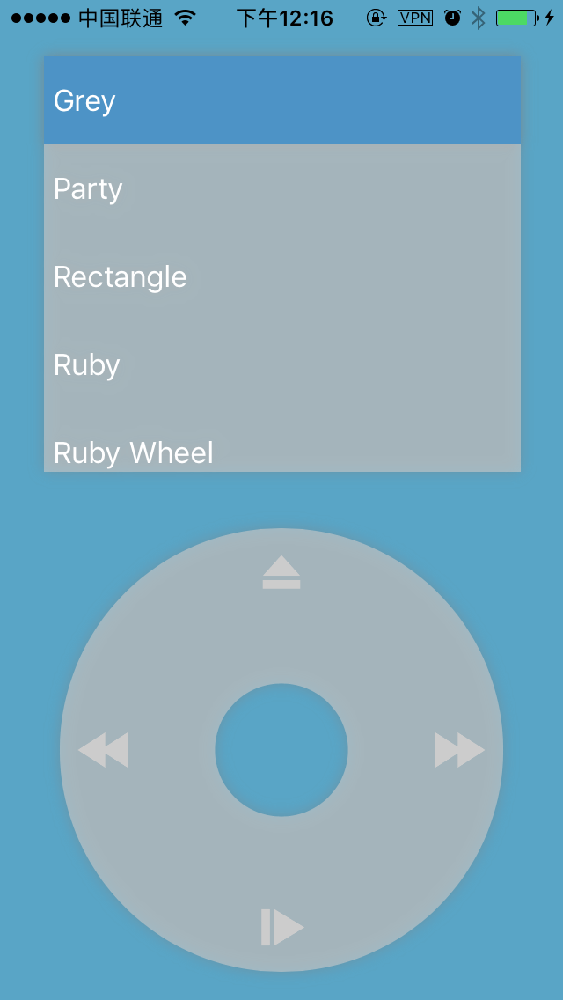
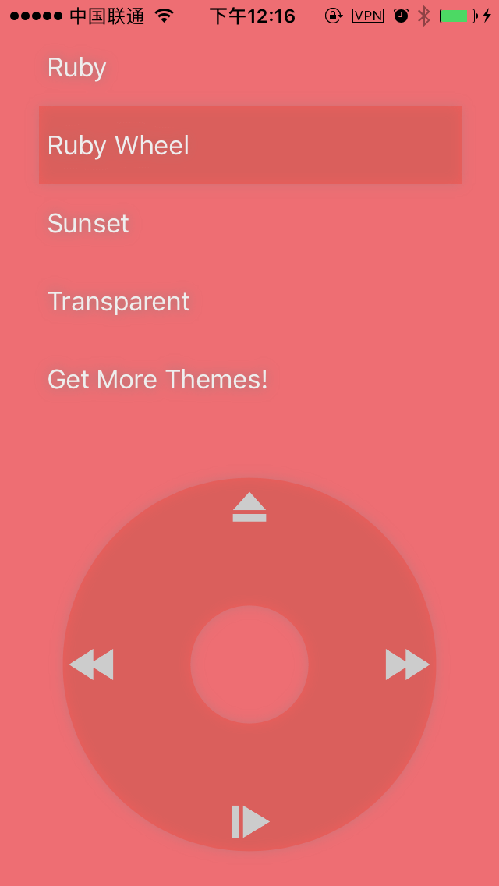
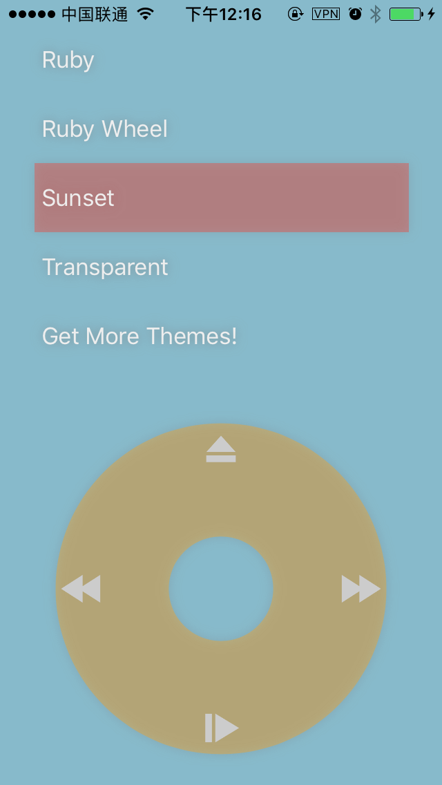
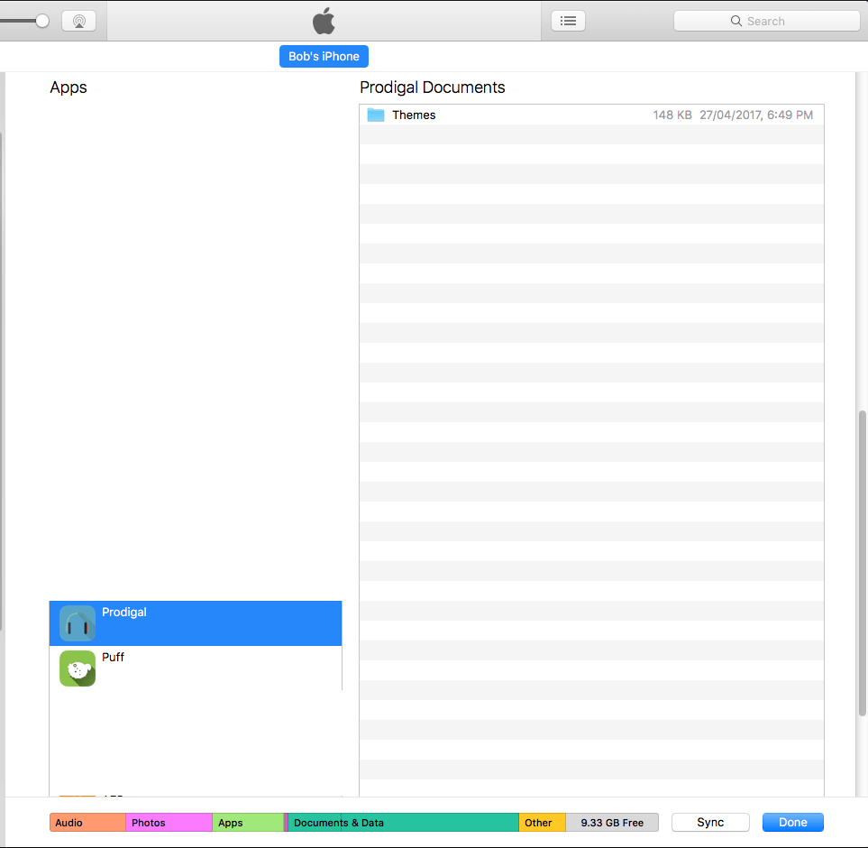

# Themes for Prodigal Music Player

### Themes Provided by Developer
[Download](https://github.com/SpongeBobSun/Prodigal-iOS/blob/master/Themes/Provided%20by%20Developer.zip)

Preview

|  |  |  |
| ---------------------------------------- | ---------------------------------------- | ---------------------------------------- |
|                                          |                                          |                                          |

# How to use themes?

* Download theme as `zip` file and extract it.
* Connect your phone to computer, then open `iTunes` if it's not automatically opened.
* Select your phone in `iTunes`, then click on `APPs` on side bar.
* Scroll down the list to find `Prodigal` and select it.
  
* Select `themes` folder, then click export.
* Copy theme folder which extracted from zip file in to `Themes` folder
* Drag Themes folder back to `Prodigal` files list in `iTunes`, then choose replace in the popped dialog.
