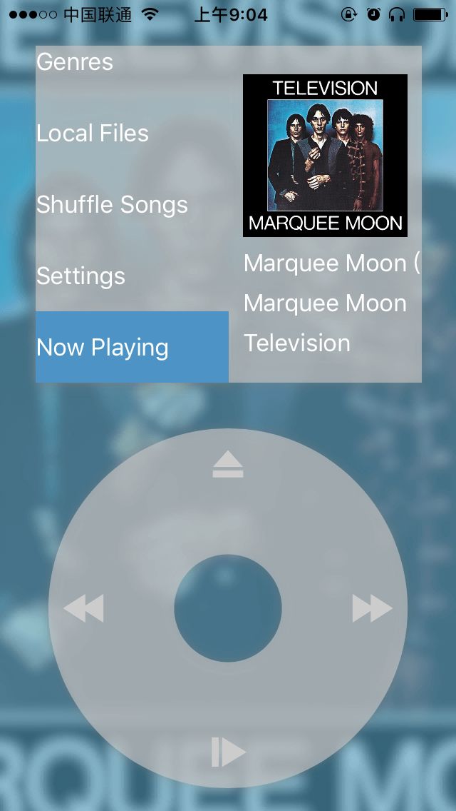
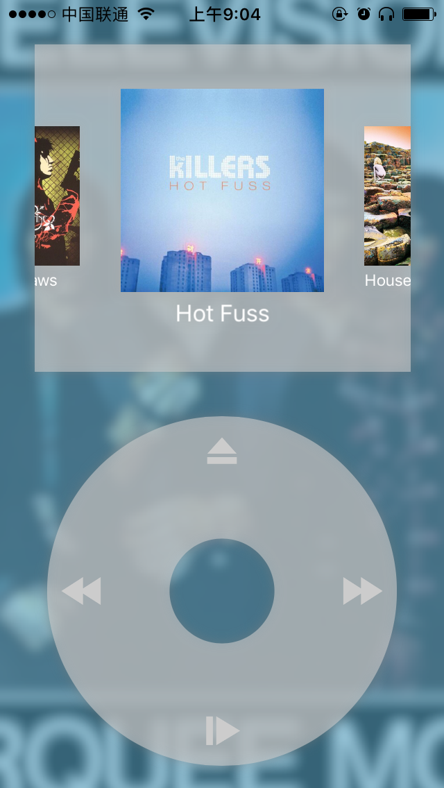
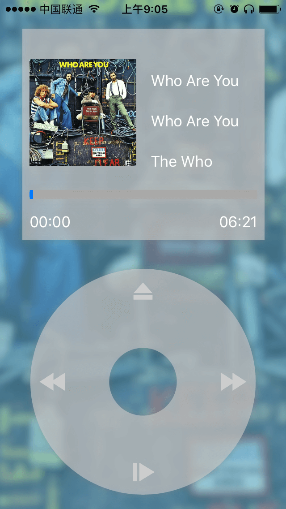
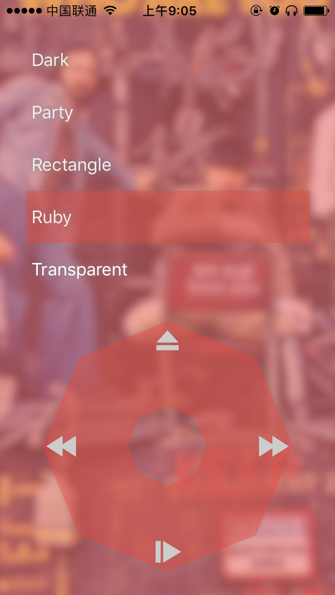
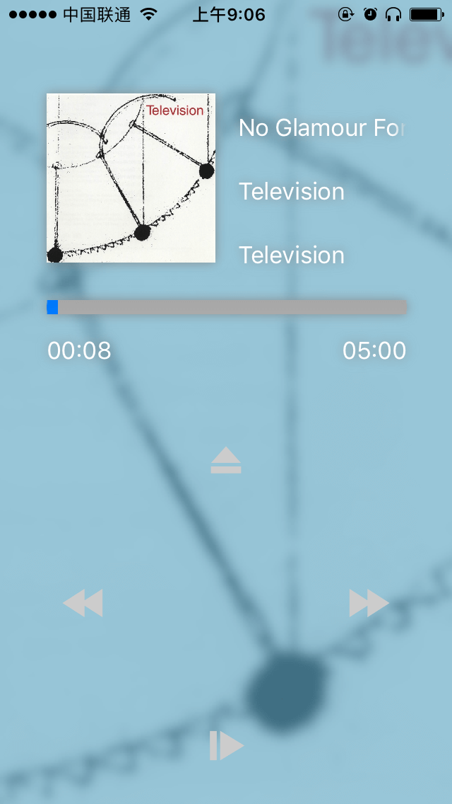

# Prodigal 

Music Player APP looks and feels like a classic device.

Bring back the good old player to life.

### Screenshots

|       |   |   |
| ------------------------------- | ----------------------------- | ----------------------------- |
| Home Page                       | Album Gallery                 | Home Page                     |
|  |  |  |
| Now Playing                     | Themes                        | Themes                        |

# Credits

Icons in this app are brought you by [Icons8.com](https://icons8.com) and [Freepik](http://www.freepik.com/)

[Marquee Label](https://github.com/cbpowell/MarqueeLabel)
[SnapKit](https://github.com/SnapKit/SnapKit)
[Haneke](https://github.com/Haneke/Haneke)
[Koloda](https://github.com/Yalantis/Koloda)

# Roadmap

```
Since APP Store has already approved this APP, I'm going to re-write the media library part, which will centralize media items both from iTunes and local file.
```

- [ ] Refactor Media Library
- [ ] Update UI on Android version
- [ ] Post bug fix

# Naming in this APP

Yep, I'm a big futurama fan. Don't be scared if you found `Bender` in my source.

Also, nearly all codes were written while listening to `Kid Rock`'s `Prodigal Son`.
